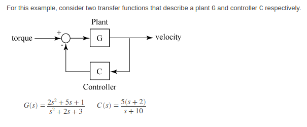

 

# GSoC 2020 @[SymPy](https://github.com/sympy/sympy)

This repository showcases my proposal, and the work done (final report) during Google Summer of Code 2020 with the SymPy project.
SymPy is a computer algebra system written in pure python.

It all started here:


The SymPy community is very welcoming and supportive. I sent an email to the SymPy mailing list around Feb 3rd, 2020, asking the community about the scope of adding a new Control Systems engineering package. Initially, their opinions were against this, and students were advised to focus on improving existing SymPy packages, *instead* of adding new packages (core or not).

I continued to show my interest in this project and guess what?? Here is the response I got finally (Thanks, [Jason](https://github.com/moorepants)):


# Project: [Control Theory - Implement a control systems package](https://summerofcode.withgoogle.com/archive/2020/projects/5417784797822976/)


Student: Naman Gera (namannimmo10)

Official Mentors:
* Nikhil Maan ([@Sc0rpi0n101](https://github.com/Sc0rpi0n101))
* Jason K. Moore ([@moorepants](https://github.com/moorepants))
* Ishan Joshi ([@ishanaj](https://github.com/ishanaj))

Since this was a big project and I had to develop a package from scratch, I got a lot of help from other members of the SymPy development team and even Control theory experts. I would also really like to thank [S.Y. Lee](https://github.com/sylee957), [Oscar Benjamin](https://github.com/oscarbenjamin), [Eric Wieser](https://github.com/eric-wieser), [Ilhan Polat](https://github.com/ilayn), and [Richard Murray](https://github.com/murrayrm) for constantly reviewing my PRs and discussing the API designs with me.

# Work done:

My main focus was to implement in SymPy, a basic Control Systems functionality from scratch. This can be used by Control engineers or professors/students to solve various [control theory](https://en.wikipedia.org/wiki/Control_theory) related problems. Being a part of SymPy, this is purely *symbolic* in nature. The advantage of this package over other packages/libraries (which are great, btw!) like [harold](https://github.com/ilayn/harold) and [python-control](https://github.com/python-control/python-control) is that the solutions obtained from it are highly accurate and do not rely on numerical methods to approximate the solutions. The solutions obtained are in a compact form that can be used for further analysis. **Documentation** is available at [Control API](https://docs.sympy.org/dev/modules/physics/control/lti.html) and [Control Intro](https://docs.sympy.org/dev/modules/physics/control/control.html).

PULL REQUESTS - 

Major additions:
* (Merged) [sympy/sympy#19390](https://github.com/sympy/sympy/pull/19390) - Adds `TransferFunction`, `Series`, `Parallel`, and `Feedback` classes for control package.
* (Merged) [sympy/sympy#19896](https://github.com/sympy/sympy/pull/19896) - Adds other useful methods in `TransferFunction` class.
* (Merged) [sympy/sympy#19761](https://github.com/sympy/sympy/pull/19761) - Adds `TransferFunctionMatrix` class in *physics.control*.

Miscellaneous PRs opened in the summer:
* (Merged) [sympy/sympy-bot#87](https://github.com/sympy/sympy-bot/pull/87) - Adds *physics.control* as valid submodule.
* (Merged) [sympy/sympy#20008](https://github.com/sympy/sympy/pull/20008) - Modify docs of `is_stable` method in `TransferFunction` class.

Future Work:
* Add `StateSpace` class for creating State space models
* Further improve the documentation of control package. Add a couple more examples to show us the users how to use the implemented functionality as they tend to use any software more if the docs are top-notch.
* Graphical analyses: `root_locus`, `pole_zero`, `bode`, and `nyquist` plots

# Examples:

This section consists of the main features that were added under `sympy.physics.control`.

A transfer function is used for representing linear, time-invariant (LTI) systems that can be strictly described by a ratio of polynomials. Here's how we can construct a transfer function:

```python
>>> from sympy.abc import s, a
>>> from sympy.physics.control import TransferFunction
>>> numerator = 2*s + a
>>> denominator = s**2 + s + 1
>>> G = TransferFunction(numerator, denominator, s) # third arg is a complex variable of the Laplace transform
>>> G
TransferFunction(a + 2*s, s**2 + s + 1, s)
>>> G.num
a + 2*s
>>> G.den
s**2 + s + 1
>>> G.var
s
```

Now using pretty-printing (which is pretty dope ;) to make it actually look like a ratio of polynomials:

```python
>>> from sympy import pprint
>>> pprint(G)
 a + 2⋅s  
──────────
 2        
s  + s + 1

>>> from sympy import init_printing
>>> init_printing(use_unicode=True)
>>> G2 = TransferFunction(s**4 - 2*s**3 + 5*s + 4, s + 4, s)
>>> -G2 # negate a transfer function
   4      3          
- s  + 2⋅s  - 5⋅s - 4
─────────────────────
        s + 4        
>>> G2**3 # take the integer power
                     3
⎛ 4      3          ⎞ 
⎝s  - 2⋅s  + 5⋅s + 4⎠ 
──────────────────────
              3       
       (s + 4)        
>>> _.expand() # now expand the num and den after taking the power
 12      11       10      9       8       7        6       5        4       3        2             
s   - 6⋅s   + 12⋅s   + 7⋅s  - 48⋅s  + 12⋅s  + 123⋅s  - 30⋅s  - 192⋅s  + 29⋅s  + 300⋅s  + 240⋅s + 64
───────────────────────────────────────────────────────────────────────────────────────────────────
                                        3       2                                                  
                                       s  + 12⋅s  + 48⋅s + 64
```

You can use a Float or an Integer (or other constants) as `num` and `den`:

```python
>>> G3 = TransferFunction(1/2, 3, a)
>>> G3.num
0.500000000000000
>>> G3.den
3
>>> G3.var
a
```

Other features used in computations:

```python
>>> TransferFunction(s + 2, s**2 - 9, s).dc_gain() # compute the gain of the response as the freq approaches 0.
-2/9
>>> TransferFunction(a, s, s).dc_gain()
∞⋅sign(a)
>>> G4 = TransferFunction((1 - s)**2, (s + 1)**2, s)
>>> G4.is_stable() # checks for the asymptotic stability
True
>>> G4.poles()
[-1, -1]
>>> G4.zeros()
[1, 1]
>>> G4.is_proper
True
>>> G4.is_biproper
True
>>> G4.is_strictly_proper
False

>>> from sympy import symbols
>>> c, p, d0, d1, d2 = symbols('c, p, d0:3')
>>> num, den = c*p, d2*p**3 + d1*p**2 - d0
>>> G5 = TransferFunction(num, den, p)
>>> G5.subs({c: 2, d0: 3, d1: 2, d2: 5})
      2⋅p      
───────────────
   3      2    
5⋅p  + 2⋅p  - 3
>>> G5.subs({c: 2, d0: 3, d1: 2, d2: 5}).evalf()
        2.0⋅p        
─────────────────────
     3        2      
5.0⋅p  + 2.0⋅p  - 3.0
>>> G5.xreplace({c: 3.0})
       3.0⋅p       
───────────────────
          2       3
-d₀ + d₁⋅p  + d₂⋅p 

>>> from sympy import factor
>>> factor(TransferFunction(s - 1, s**2 - 2*s + 1, s))
 s - 1  
────────
       2
(s - 1) 
>>> TransferFunction((p + 3)*(p - 1), (p - 1)*(p + 5), p).simplify()
p + 3
─────
p + 5
```

Now, let's do some SISO transfer function algebra:

```python
>>> init_printing(use_unicode=False)
>>> G6 = TransferFunction(s + 1, s**2 + s + 1, s)
>>> G6
  s + 1   
----------
 2        
s  + s + 1
>>> G7 = TransferFunction(s - p, s + 3, s)
>>> G7
-p + s
------
s + 3 
>>> G8 = TransferFunction(4*s**2 + 2*s - 4, s - 1, s)
>>> G8
   2          
4*s  + 2*s - 4
--------------
    s - 1     
>>> G9 = TransferFunction(a - s, s**2 + 4, s)
>>> G9
a - s 
------
 2    
s  + 4

>>> G6 + G7 # just adding two TFs will leave them unevaluated
  s + 1      -p + s
---------- + ------
 2           s + 3 
s  + s + 1         
>>> # `.doit()` will evaluate the result above
>>> # `.rewrite(TransferFunction)` does the same.
>>> _.doit()
         ⎛ 2        ⎞                  
(-p + s)⋅⎝s  + s + 1⎠ + (s + 1)⋅(s + 3)
───────────────────────────────────────
                  ⎛ 2        ⎞         
          (s + 3)⋅⎝s  + s + 1⎠
>>> G8 - G9
   2                   
4⋅s  + 2⋅s - 4   -a + s
────────────── + ──────
    s - 1         2    
                 s  + 4
>>> G6 * G9
⎛  s + 1   ⎞ ⎛a - s ⎞
⎜──────────⎟⋅⎜──────⎟
⎜ 2        ⎟ ⎜ 2    ⎟
⎝s  + s + 1⎠ ⎝s  + 4⎠
>>> G8 * G9 + G6 - G7 # do all at the same time
⎛   2          ⎞                              
⎜4⋅s  + 2⋅s - 4⎟ ⎛a - s ⎞     s + 1      p - s
⎜──────────────⎟⋅⎜──────⎟ + ────────── + ─────
⎝    s - 1     ⎠ ⎜ 2    ⎟    2           s + 3
                 ⎝s  + 4⎠   s  + s + 1
>>> (G8 * G9 + G6).rewrite(TransferFunction)
        ⎛ 2        ⎞ ⎛   2          ⎞                   ⎛ 2    ⎞
(a - s)⋅⎝s  + s + 1⎠⋅⎝4⋅s  + 2⋅s - 4⎠ + (s - 1)⋅(s + 1)⋅⎝s  + 4⎠
────────────────────────────────────────────────────────────────
                         ⎛ 2    ⎞ ⎛ 2        ⎞                  
                 (s - 1)⋅⎝s  + 4⎠⋅⎝s  + s + 1⎠
```

A class for representing negative feedback interconnection between input/output systems was also added - `Feedback`.
Here's how solve a basic block diagram problem (having a negative feedback) with that class:



```python
>>> from sympy.physics.control import Feedback
>>> G = plant = TransferFunction(2*s**2 + 5*s + 1, s**2 + 2*s + 3, s)
>>> C = controller = TransferFunction(5*(s + 2), s + 10, s)
>>> velocity = Feedback(plant, controller)
>>> velocity
        ⎛   2          ⎞       
        ⎜2⋅s  + 5⋅s + 1⎟       
        ⎜──────────────⎟       
        ⎜  2           ⎟       
        ⎝ s  + 2⋅s + 3 ⎠       
───────────────────────────────
    ⎛   2          ⎞           
1   ⎜2⋅s  + 5⋅s + 1⎟ ⎛5⋅s + 10⎞
─ + ⎜──────────────⎟⋅⎜────────⎟
1   ⎜  2           ⎟ ⎝ s + 10 ⎠
    ⎝ s  + 2⋅s + 3 ⎠
>>> velocity.doit() # this gives the resultant closed-loop transfer function
                        ⎛ 2          ⎞ ⎛   2          ⎞               
               (s + 10)⋅⎝s  + 2⋅s + 3⎠⋅⎝2⋅s  + 5⋅s + 1⎠               
──────────────────────────────────────────────────────────────────────
⎛         ⎛ 2          ⎞              ⎛   2          ⎞⎞ ⎛ 2          ⎞
⎝(s + 10)⋅⎝s  + 2⋅s + 3⎠ + (5⋅s + 10)⋅⎝2⋅s  + 5⋅s + 1⎠⎠⋅⎝s  + 2⋅s + 3⎠
>>> velocity.doit().simplify() # we can further cancel poles and zeros
                      ⎛   2          ⎞              
             (s + 10)⋅⎝2⋅s  + 5⋅s + 1⎠              
────────────────────────────────────────────────────
          ⎛   2          ⎞            ⎛ 2          ⎞
5⋅(s + 2)⋅⎝2⋅s  + 5⋅s + 1⎠ + (s + 10)⋅⎝s  + 2⋅s + 3⎠
```


# My GSoC Experience and Learnings:

I've been writing weekly blog-posts documenting my journey during
GSoC. The blog is hosted at [namannimmo.me/emerald](https://namannimmo10.github.io/emerald/).
This experience was so amazing and complete and I learned lots of different things; I can't write them all in here.

But, here are a few:
1. Having to adjust to my team members' different timezones was *definitely* a challenge. I also loved the challenge of working with a remote team and leaving my comfort zone of talking in person to work on something
2. I also learned written communication. Writing accurately is difficult, so I had to learn how to convey my thoughts well enough, because we were working remotely, right?
3. I had not implemented any package from scratch before, so this was a challenge in itself. But the mentors were helpful enough and discussed everything with me - they were readily available for discussions
4. If could repeat this again, I would do so. This community is so welcoming, even if you come up with a *naïve* approach of solving a particular problem, they will help you to improve the code even further because we had to adhere to the SymPy standards
5. Since a lot of people get confused in the beginning, I've written a detailed answer on Quora for students preparing for GSoC. Here's [my answer](https://qr.ae/pNc0Tm) to "How can I apply and prepare for Google Summer of Code?" - hope this helps!

Edit: I'm mentoring for SymPy in GSoC 2021.

`:wq` for now.

------------------------------------------------------------------------------------------------

Naman Gera (namannimmo)

[Email](mailto:namangera15@gmail.com) | [GSoC blog](https://namannimmo10.github.io/emerald/) |  [StackOverflow](https://stackoverflow.com/users/11750129/namannimmo) | [Quora](https://www.quora.com/profile/Naman-Gera-11/)
